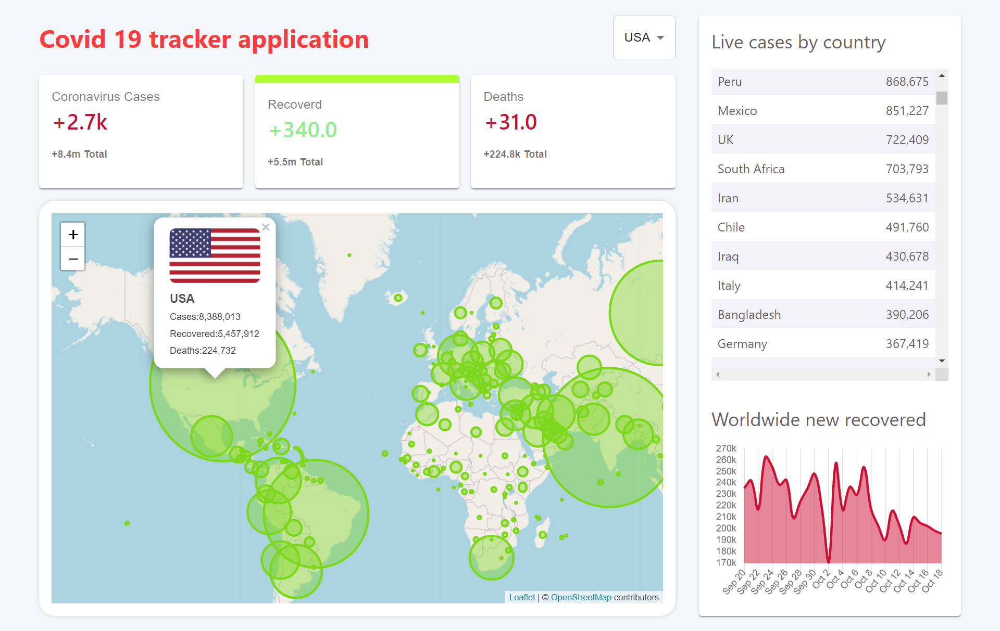
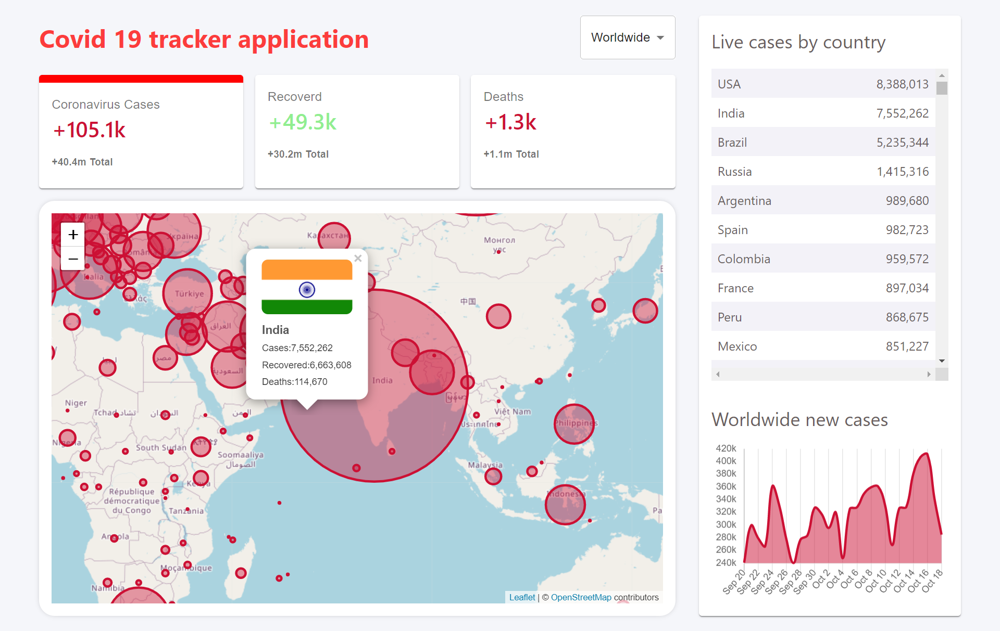

This project was bootstrapped with [Create React App](https://github.com/facebook/create-react-app).
# Covid-19 Tracker
This is `Responsive` web application which tracks **covid-19 _Live_** cases all over the world 

## Description
>*Project is build with React JS and Material-UI and deployed on Firebase*

## :dizzy: Live Demo
here's [Live Demo](https://covid-19-tracker-30ce0.web.app/) of Covid-19 Tracker

## Project Snaps
here are some images 

