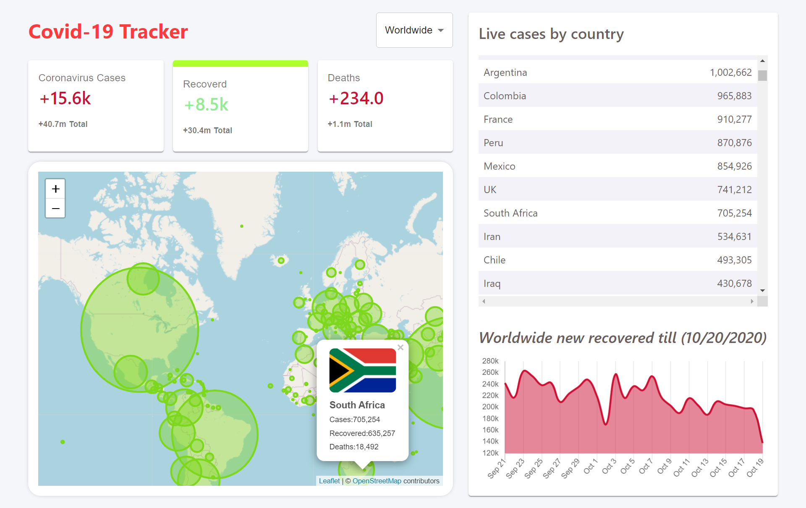
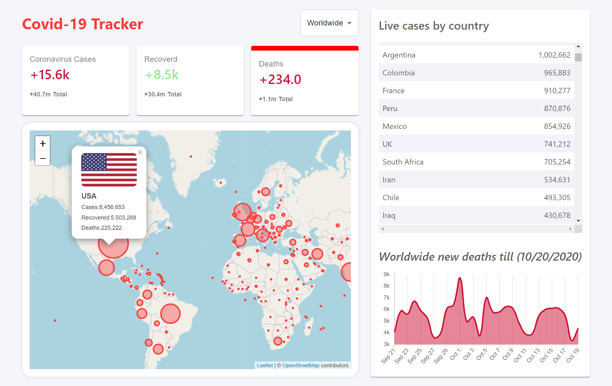

This project was bootstrapped with [Create React App](https://github.com/facebook/create-react-app).
# Covid-19 Tracker :globe_with_meridians:
This is `Responsive` web application which tracks **covid-19 _Live_** cases all over the World 
## Description
*Project is build with `React JS and Material-UI` and deployed on `Firebase`*. 
**It provied COVID19 global data overviews to specific country data on the current outbreak of Influenza**

## :dizzy: Live Demo
here's [Live Demo](https://covid-19-tracker-30ce0.web.app/) of Covid-19 Tracker

## Project Snaps
here are some images 
 

## Used Library/Packages
- :snowflake: [React JS](https://reactjs.org/)
- :diamonds: [Material-ui](https://material-ui.com/)
- :bar_chart: [react-chartjs-2](https://www.npmjs.com/package/react-chartjs-2)
- :fire: [Firebase](https://firebase.google.com/)
- :earth_americas: [Leafletjs Map](https://leafletjs.com/)

## Covid-19 Data
the covid-19 **`live`** data has been pulled from An open :point_right: **[API Disease-sh](https://corona.lmao.ninja/)** for disease-related statistics.
This API provides a big range of detailed information about multiple viruses
## Run code on your machine
clone the project and simply run npm commands
1. npm install
2. npm start ( This will run app on local sever hit [http://localhost:3000/](http://localhost:3000/) on ur browser )
3. npm run build
